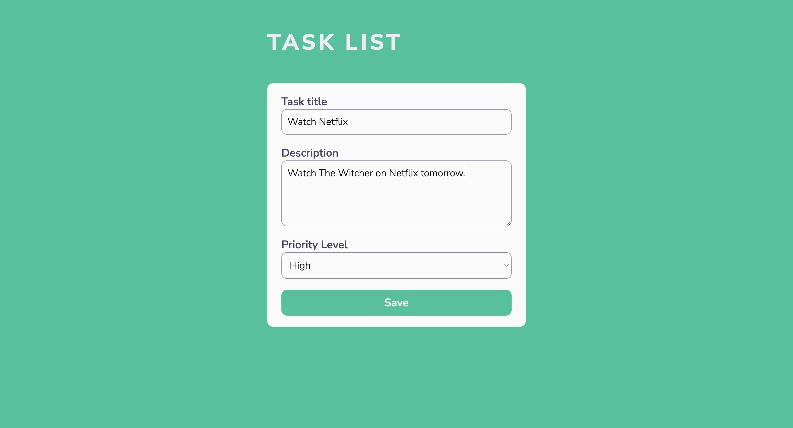
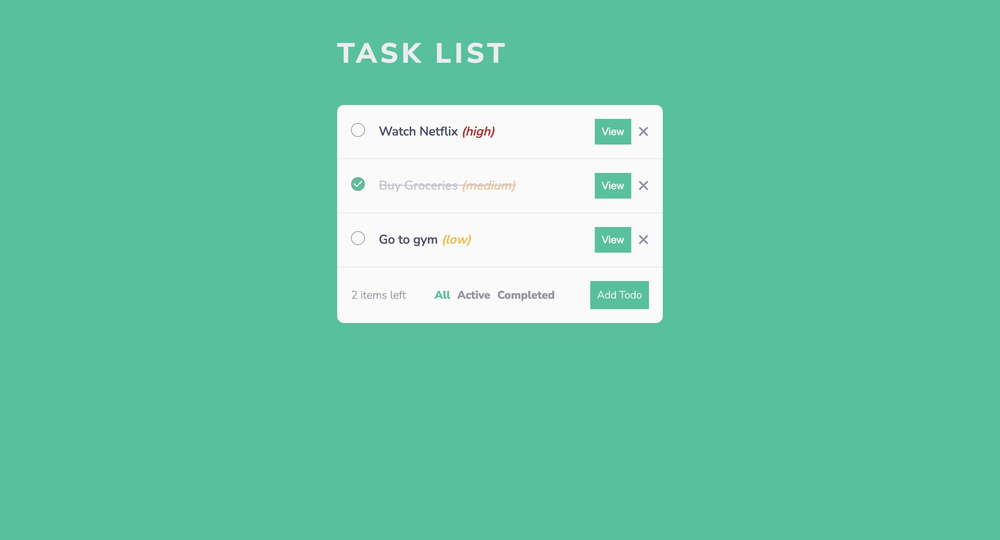
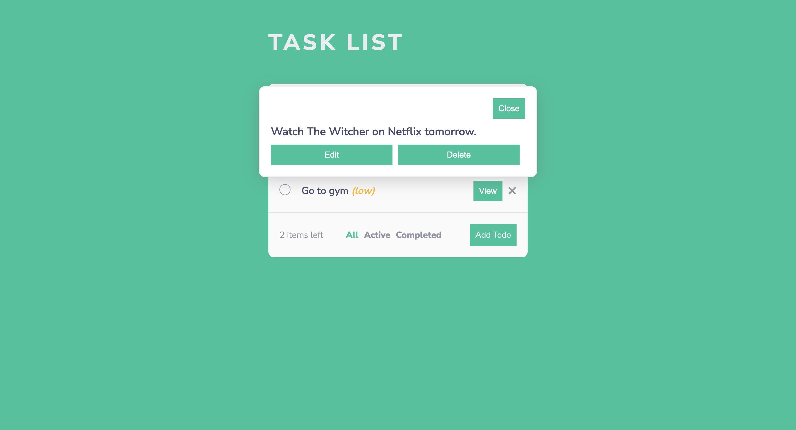

# Question 1:

Describe a Complex Frontend Project Experience

I am a physics post graduated turned web developer. My first project was with Drupal and I had to code apis and integrate them as well. As a newbie in this field it was very challenging for me during the first few weeks. But as I persevered, it gradually became easier.
I wanted to explore the React framework and out of my own interest I took courses and started coding few small projects which could be found on my github repo.
So far my challenging project was user authentication using the MERN stack.

# Getting Started with Create React App

This project was bootstrapped with Create React App;

## Available Scripts

In the project directory, you can run:

### `npm start`

Runs the app in the development mode.\
Open [http://localhost:3000](http://localhost:3000) to view it in your browser.

The page will reload when you make changes.\
You may also see any lint errors in the console.

# Description

In the TaskList App, user can add, edit, delete a task.
User can filter active and completed tasks.
React-Context has been used for state management.
React-Router v6 has been been to navigate between pages.

# Screenshot

